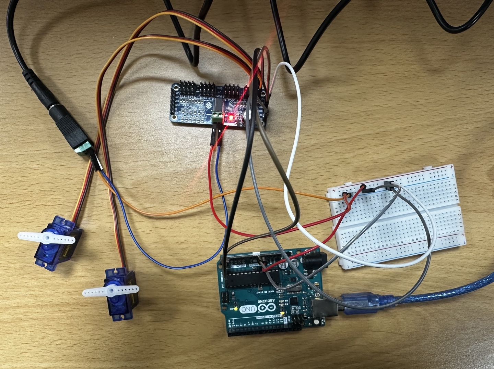
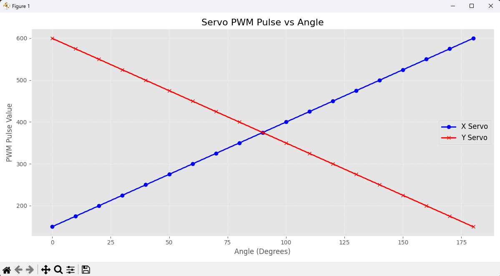

# Arduino-VL53L0X-3D-Scanner
VL53L0X와 서보모터를 활용한 아두이노 기반 3차원 거리 측정기

- 아두이노와 VL53L0X 거리 센서, 2축 서보모터를 활용한 저비용 3D 거리 측정 프로젝트
- 센서 데이터를 실시간으로 수집해 3D 좌표로 변환하고, Python으로 시각화

---

##  주요 기능

- 2축 서보로 회전하며 거리 측정  
- 거리 + 각도 → 3D 좌표 변환  
- `matplotlib` 기반 실시간 3D 포인트맵 시각화  
- Raspberry Pi GPIO, I2C, PWM 연동  
- 저전력, 저비용 구성

---

## 부품 구성 목록

| 장치               | 설명                             | 모델                          |
|--------------------|----------------------------------|-------------------------------|
| 서보모터 1         | 수평 회전용 (θ 축)               | SG90                          |
| 서보모터 2         | 수직 회전용 (φ 축)               | SG90                          |
| 거리 센서          | 적외선 TOF 거리 측정             | VL53L0X                       |
| 아두이노 보드      | 제어 + 연산 + 시각화             | Arduino UNO                   |
| 서보 드라이버보드  | 안정적인 PWM 제어                | PCA9685 (16채널)              |
| 전원 공급장치      | 서보용 외부 전원                 | 5V 2A 어댑터                  |
| 점퍼 케이블 세트   | 모듈 연결용                      | Male-Female 점퍼케이블        |
| 브레드보드 + 저항  | 시제품 연결 테스트               | 미니 브레드보드 / 기본 키트   |


## 프로젝트 구성

### 관련 이론

## 1. I2C 통신이란?

**I2C (Inter-Integrated Circuit)**는 단 **2개의 라인(SDA, SCL)**으로 여러 디바이스를 연결할 수 있는 직렬 통신 방식

- **저속이지만 안정적인 통신 방식**
- **하나의 마스터와 여러 슬레이브** 구조
- 센서, LCD, 드라이버 등 다양한 모듈 제어에 활용

---

## 2. SDA & SCL 설명

| 라인 | 이름 | 역할 |
|------|------|------|
| SDA  | Serial Data Line | 데이터 송수신 담당 |
| SCL  | Serial Clock Line | 마스터가 생성하는 클럭 신호 제공 |

- Arduino 보드는 **A4(SDA), A5(SCL)** 핀을 사용
- **데이터는 SDA로**, **타이밍은 SCL로** 동기화

---

## 3. I2C 클럭의 역할

- **SCL(Serial Clock Line)**은 마스터가 생성하며, 모든 데이터 송수신의 기준 타이밍을 제공
- 클럭이 없으면 언제 데이터를 읽고 쓸지 몰라 통신이 불가능 함.

| 모드 | 속도 |
|------|------|
| 표준(Standard) | 100kHz |
| 패스트(Fast)   | 400kHz |
| 하이스피드     | 3.4MHz (일반적으로 사용하지 않음) |

```text
SCL: ──┐    ┌────┐    ┌────┐
       └────┘    └────┘    (↑ 타이밍 동기화)
```

## 4. 마스터-슬레이브 구조

- I2C는 **마스터(Master)**와 **슬레이브(Slave)** 장치 간 통신을 기반 함

| 역할 | 기능 |
|------|------|
| 마스터 (Master) | 통신 시작 및 종료 제어<br>클럭 생성(SCL)<br>슬레이브 주소 지정 및 데이터 요청 |
| 슬레이브 (Slave) | 마스터 요청 수신<br>해당 주소와 일치할 경우 응답<br>데이터 송/수신 수행 |

- 한 시스템에 **마스터는 보통 1개**, **슬레이브는 최대 127개** 연결 가능 (7bit 주소 체계 기준)
- 슬레이브 주소 충돌 방지를 위해 **고유한 주소 설정** 필요
- 동일한 센서를 여러 개 사용할 경우, **MUX 회로 또는 주소 변경 기능 필요**

---

## 5. PCA9685 PWM 드라이버란?

**PCA9685**는 I2C 통신을 통해 제어 가능한 **16채널 PWM 출력 보드**입니다. 서보 모터나 LED 밝기 제어 등에 주로 사용

### 주요 특징

- 최대 16개 채널 개별 PWM 제어
- **12-bit 분해능 (0 ~ 4095)**
- PWM 주파수: 40 ~ 1000Hz
- 서보 제어에 적합한 **50Hz PWM** 지원
- 기본 I2C 주소: `0x40`

### 핀 설명

| 핀명 | 기능 |
|------|------|
| VCC  | 보드 동작 전원 (3.3V 또는 5V) |
| GND  | 아두이노와 공통 접지 |
| SDA  | I2C 데이터 라인 |
| SCL  | I2C 클럭 라인 |
| V+   | 서보모터에 공급할 외부 전원 입력 (5~6V) |

> **V+는 반드시 외부 전원 사용**, GND는 **아두이노와 공통 접지**해야 서보 정상 동작 함!!

---

## 6. 듀티비(Duty Cycle)와 서보 제어 원리

### PWM이란?

- PWM(Pulse Width Modulation)은 **빠르게 ON/OFF를 반복하는 디지털 신호**로 아날로그 효과를 내는 방식
- 서보모터의 각도는 **펄스 폭(ON 시간)**에 따라 결정

### 듀티비란?

> **듀티비(Duty Cycle)** = (ON 시간 / 전체 주기) × 100%

- 서보모터에서 일반적으로 사용하는 **50Hz (20ms 주기)** 기준:

| 각도 | 펄스 폭 | 듀티비 (%) |
|------|---------|------------|
| 0°   | 1.0ms   | 5%         |
| 90°  | 1.5ms   | 7.5%       |
| 180° | 2.0ms   | 10%        |

### PCA9685에서 각도 제어 방법

- 12-bit 분해능 → 1사이클 = 4096 스텝
- `펄스 스텝 = (펄스 시간 / 주기) × 4096`
- 예: 1.5ms / 20ms × 4096 = **307**

#### 아두이노 매핑 예시

```cpp
#define SERVOMIN 150  // 서보 0도에 해당하는 최소 펄스 폭
#define SERVOMAX 600  // 서보 180도에 해당하는 최대 펄스 폭

int pulse = map(angle, 0, 180, SERVOMIN, SERVOMAX);
pwm.setPWM(channel, 0, pulse);
```

#### 아두이노 예제 코드 (PCA9685 사용)

```cpp
#include <Wire.h>
#include <Adafruit_PWMServoDriver.h>

// PCA9685 객체 생성
Adafruit_PWMServoDriver pwm = Adafruit_PWMServoDriver();

#define SERVOMIN 150  // 0도에 해당하는 펄스 폭
#define SERVOMAX 600  // 180도에 해당하는 펄스 폭

void setup() {
    pwm.begin();            // PCA9685 초기화
    pwm.setPWMFreq(50);     // 서보모터용 50Hz 주파수 설정
}

void loop() {
    int angle = 90;  // 서보 각도
    int pulse = map(angle, 0, 180, SERVOMIN, SERVOMAX);  // 각도를 펄스 폭으로 변환
    pwm.setPWM(0, 0, pulse);  // 채널 0번 서보 제어
    delay(1000);
}
```

## 8. 구면 좌표계 → 직교 좌표계 변환

### 각도 범위

- **θ (Theta)** : 수평축 회전 → `0° ~ 180°`
- **φ (Phi)** : 수직축 회전 → `0° ~ 90°`
- **d** : 거리 센서로부터 측정된 거리 (단위: mm 또는 cm)

### 변환 공식

> θ, φ는 **라디안 단위로 변환한 후** 삼각함수에 적용

**x** = *d* · sin(φ) · cos(θ)  
**y** = *d* · sin(φ) · sin(θ)  
**z** = *d* · cos(φ)

---

### Python 예제 코드

```python
import math

def spherical_to_cartesian(d, theta_deg, phi_deg):
    theta = math.radians(theta_deg)  # 수평각 → 라디안
    phi = math.radians(phi_deg)      # 수직각 → 라디안

    x = d * math.sin(phi) * math.cos(theta)
    y = d * math.sin(phi) * math.sin(theta)
    z = d * math.cos(phi)

    return (x, y, z)
```

## 1일차

### 서보모터 PWM 제어 실험

### 실험 개요
- **PWM 보드**를 사용했을 때와 **사용하지 않았을 때**의 서보모터 제어 성능 비교
- `matplotlib`를 활용해 **입력 각도와 출력 펄스(PWM)** 관계를 시각적으로 분석
- X/Y 축 2개의 서보를 동기 제어하여 **대칭성 및 선형성** 판단

### 실험 목적
- **PWM 제어의 선형성 시각화** : 서보모터에 입력되는 PWM 값이 각도에 정확히 비례하는지 확인
- **X/Y 축 반응 대칭성 검증** : 두 축 서보모터가 서로 반대 방향으로 정확히 대응하는지 분석
- **PWM 보드 응답성 평가** : PCA9685가 각도 변화에 대해 일정한 펄스를 출력하는지 확인

### 시각화로 확인 가능한 항목

- **PWM 값 선형성**
    - 각도 증가에 따라 PWM도 선형적으로 증가 -> X_pos 값이 직선형으로 증가 

- **X/Y축 대칭성**
    - X가 증가하면 Y는 동일 비율로 감소 -> 두 곡선이 대칭 형태로 변화(중앙에서 교차)

- **1도당 펄스 분해능**
    - 1도당 펄스 변화가 정밀한가 -> 점 간 간격이 균일한지 확인
    
- **응답 정밀도** 
    - 각도 ↔ 펄스 간 비례 관계 유지 여부 -> 일정한 기울기의 직선 여부

### 실험 결과

- **Servo Motor + Arduino 직접 제어**
    - 기본적인 동작은 **문제없이 잘 수행됨**
    - `PWM 보드 없이도` 2개의 서보모터를 제어할 때는 **차이를 못느끼겠음**
    - 시각적으로 보았을 때 **PWM 보드 방식과 큰 차이를 체감하긴 어려움**

- **PWM 보드 (PCA9685) 제어**
    - [PWM 시각화 코드](./1일차/pwm_servo_angle.py) / [PWM 데이터](./1일차/pwm_servo_log.csv) / [PWM 소스코드](./PWM_Servo_control/PWM_Servo_control.ino)
    - **부드럽고 선형적인 제어 가능**
    - `X <-> Y` 반응이 정확히 대칭적이며, 고해상도 펄스 조절 가능

        

        

> 결론적으로, **2개의 서보모터만 사용할 경우에는 PWM 보드 유무에 따른 큰 차이를 느끼기 어려움**

### 왜 PWM 보드를 사용할까?

- **확장성** : 3개 이상 서보모터 제어 시, 아두이노 PWM 핀 한계 발생
- **정밀 제어** : 12bit 해상도 (4096단계)로 0.09° 단위까지 미세 조절 가능
- **전원 분리 용이** : 고전류 모터 사용 시 외부 전원 분리로 **발열, 리셋 방지**
- **선형성 신뢰** : 각도 <-> 펄스 변화가 정확하게 일치 -> 더 안정적인 움직임 기대

### 2일차(25.06.07)

> **서보모터 3개 이상**을 동시 제어하며 PWM 보드의 **확장성, 정밀성, 안정성** 차이를 **더 명확하게 분석 예정**

### 결론

- 서보 2개까지는 **PWM 없이도 충분히 제어 가능**
- 하지만, **프로젝트가 확장되거나 정밀 제어가 요구되는 경우** -> **PWM 보드(PCA9685)** 사용이 훨씬 유리하며, **안정성, 확장성, 정밀도** 모두에서 뛰어난 선택이 될 수 있음

> 지금은 비슷해 보이지만, 프로젝트가 커질수록 PWM 사용이 더 용이해 보임!
