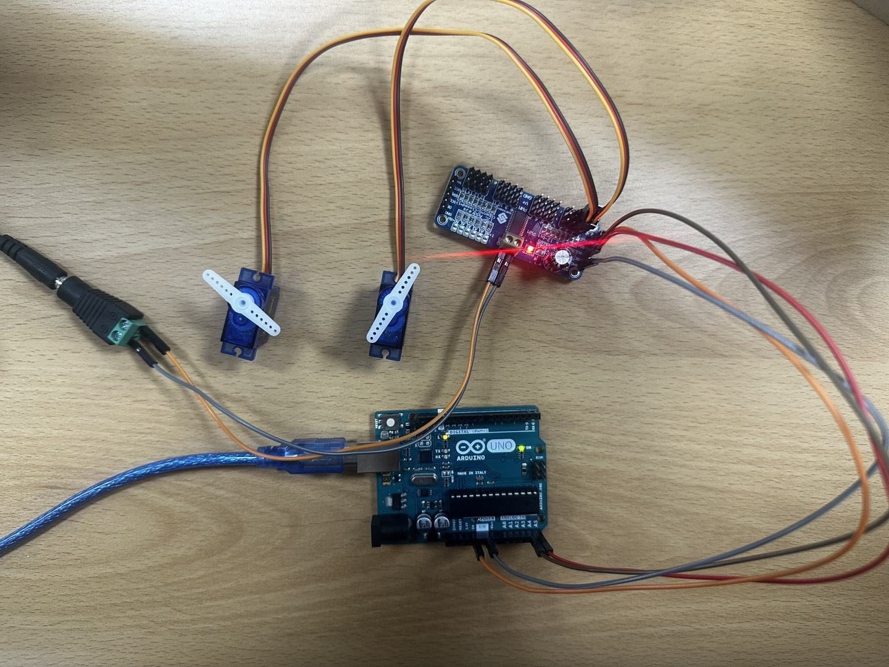

# Arduino-VL53L0X-3D-Scanner
VL53L0X와 서보모터를 활용한 아두이노 기반 3차원 거리 측정기

## 1일차

### 서보모터 PWM 제어 실험

### 실험 개요
- **PWM 보드**를 사용했을 때와 **사용하지 않았을 때**의 서보모터 제어 성능 비교
- `matplotlib`를 활용해 **입력 각도와 출력 펄스(PWM)** 관계를 시각적으로 분석
- X/Y 축 2개의 서보를 동기 제어하여 **대칭성 및 선형성** 판단

### 실험 목적
- **PWM 제어의 선형성 시각화** : 서보모터에 입력되는 PWM 값이 각도에 정확히 비례하는지 확인
- **X/Y 축 반응 대칭성 검증** : 두 축 서보모터가 서로 반대 방향으로 정확히 대응하는지 분석
- **PWM 보드 응답성 평가** : PCA9685가 각도 변화에 대해 일정한 펄스를 출력하는지 확인

### 시각화로 확인 가능한 항목

- **PWM 값 선형성**
    - 각도 증가에 따라 PWM도 선형적으로 증가 -> X_pos 값이 직선형으로 증가 

- **X/Y축 대칭성**
    - X가 증가하면 Y는 동일 비율로 감소 -> 두 곡선이 대칭 형태로 변화(중앙에서 교차)

- **1도당 펄스 분해능**
    - 1도당 펄스 변화가 정밀한가 -> 점 간 간격이 균일한지 확인
    
- **응답 정밀도** 
    - 각도 ↔ 펄스 간 비례 관계 유지 여부 -> 일정한 기울기의 직선 여부

### 실험 결과

- **Servo Motor + Arduino 직접 제어**
    - 기본적인 동작은 **문제없이 잘 수행됨**
    - `PWM 보드 없이도` 2개의 서보모터를 제어할 때는 **차이를 못느끼겠음**
    - 시각적으로 보았을 때 **PWM 보드 방식과 큰 차이를 체감하긴 어려움**

- **PWM 보드 (PCA9685) 제어**
    - [PWM 시각화 코드](./1일차/pwm_servo_angle.py) / [PWM 데이터](./1일차/pwm_servo_log.csv) / [PWM 소스코드](./PWM_Servo_control/PWM_Servo_control.ino)
    - **부드럽고 선형적인 제어 가능**
    - `X <-> Y` 반응이 정확히 대칭적이며, 고해상도 펄스 조절 가능

        

        

> **2개의 서보모터만 사용할 경우에는 PWM 보드 유무에 따른 큰 차이를 느끼기 어려움**

## 2일차

### 서보모터 3개 이상 제어 실험

- 실험 목표
    - 서보모터 3개 이상을 동시에 제어
    - PCA9685 PWM 보드 사용 시 확장성, 정밀성, 안정성 비교 및 분석

### 실험 결론

- 서보모터 2개 제어와 동일하게 서보모터 3개 제어할 경우, 아두이노 자체 PWM 핀으로도 큰 문제 없이 제어 가능

#### 그럼 왜 PWM 보드를 사용할까?
-  복합 시스템에서는 핀 부족, 전력 분산, 타이밍 정밀도 문제를 동시에 해결해야 함. 이때, PCA9685 PWM 보드는 가장 효과적인 해결책이라고 생각함!!

    - I2C 통신 기반: 거리 센서(VL53L0X), LCD, PCA9685 모두 I2C를 사용 -> 하나의 버스에서 동시 연결 가능

    - 핀 수 제약 해소 : 서보모터가 많아져도 아두이노의 PWM 핀 수에 의존하지 않음 -> 확장성 확보

    - 배선 단순화 : 모든 장치를 I2C 버스에 연결하면, 복잡한 PWM 배선 -> 단 2개의 I2C 선으로 통합

    - 전력 분산 구조 : 보드 자체에 외부 5V 전원을 공급 -> 서보 부하로 인한 아두이노 전원 불안정 방지

> 서보 2개 + 거리센서 + LCD 등 다양한 장치를 함께 사용하는 복합 시스템에서는 PWM 보드(PCA9685) 사용이 더 안정적이고 효율적이라고 느낌


### 서보모터 PWM 제어 원리

- **주기**: 50Hz (1주기 = 20ms 간격)
- **제어 방식**: 펄스폭(µs)에 따라 회전 각도 결정 (500~2500µs 일반적)
- **동작 원리**: 펄스폭이 길수록 더 오른쪽(끝 방향)으로 회전

| 각도  | 펄스폭 (µs) | PCA9685 PWM 값 (0~4095 기준)  |
|-------|-------------|-------------------------------|
| 0°    | 500         | ≈ 102                         |
| 90°   | 1500        | ≈ 307                         |
| 180°  | 2500        | ≈ 512                         |

### PCA9685 펄스 → PWM 값 변환 공식

```text
PWM 값 = (펄스폭 µs / 20000 µs) × 4096
```

- 예시:
  - 500 µs → `(500 / 20000) × 4096` ≈ 102  
  - 1500 µs → `(1500 / 20000) × 4096` ≈ 307  
  - 2500 µs → `(2500 / 20000) × 4096` ≈ 512


### 일반적으로 서보모터 PWM 범위
- PCA9685 기준 펄스 값 : **2-bit(0 ~ 4095)**

    ```cpp
    #define SERVOMIN 150  // 약 0도
    #define SERVOMAX 600  // 약 180도
    ```

### 실측 테스트 결과 (직접 측정값 기반)
- 서보모터를 개별 테스트한 결과

|서보명(SG90) | 측정된 SERVOMIN | 측정된 SERVOMAX | 특이사항               |
|-------------|-----------------|-----------------|------------------------|
| A모터       | 80	            | 545	          | 545 초과 → 비정상 동작 |
| B모터	      | 105             | 520	          | 520 초과 → 비정상 동작 |

### 서보 범위 측정용 코드 (PCA9685 기준)

```cpp
#include <Wire.h>
#include <Adafruit_PWMServoDriver.h>

Adafruit_PWMServoDriver pwm = Adafruit_PWMServoDriver(0x40);

void setup() {
  pwm.begin();
  pwm.setPWMFreq(50);  // 50Hz 고정
  delay(1000);
}

void loop() {
  for (int pulse = 80; pulse <= 600; pulse += 5) {
    pwm.setPWM(0, 0, pulse);
    delay(300);
  }
}
```
- pulse 값을 변경하며 최소/최대 범위를 직접 측정

- 비정상 작동 구간(역방향, 떨림 등) 확인

## 3일차
- 서보모터마다 요구하는 PWM 펄스 폭이 서로 다를 경우, 어떻게 정확하게 제어해야 할까?
- 현재 프로젝트에서 가장 핵심적이고 시급하게 해결해야 과제!!
- 각 서보에 맞는 개별 보정값을 설정해야 할지, 아니면 모든 서보에 일반적인 기준값인 150~600 범위를 강제 적용해야 할지 고민이 필요

> **내일 이 부분을 중점적으로 테스트하고, 서보마다 최적의 PWM 범위를 찾아내는 과정이 필요!!**


##  주요 기능

- 2축 서보로 회전하며 거리 측정  
- 거리 + 각도 → 3D 좌표 변환  
- `matplotlib` 기반 실시간 3D 포인트맵 시각화  
- 저전력, 저비용 구성


### 관련 이론

## 1. I2C 통신이란?

**I2C (Inter-Integrated Circuit)**는 단 **2개의 라인(SDA, SCL)**으로 여러 디바이스를 연결할 수 있는 직렬 통신 방식

- **저속이지만 안정적인 통신 방식**
- **하나의 마스터와 여러 슬레이브** 구조
- 센서, LCD, 드라이버 등 다양한 모듈 제어에 활용

## 2. SDA & SCL 설명

| 라인 | 이름 | 역할 |
|------|------|------|
| SDA  | Serial Data Line | 데이터 송수신 담당 |
| SCL  | Serial Clock Line | 마스터가 생성하는 클럭 신호 제공 |

- Arduino 보드는 **A4(SDA), A5(SCL)** 핀을 사용
- **데이터는 SDA로**, **타이밍은 SCL로** 동기화

## 3. I2C 클럭의 역할

- **SCL(Serial Clock Line)**은 마스터가 생성하며, 모든 데이터 송수신의 기준 타이밍을 제공
- 클럭이 없으면 언제 데이터를 읽고 쓸지 몰라 통신이 불가능 함.

| 모드 | 속도 |
|------|------|
| 표준(Standard) | 100kHz |
| 패스트(Fast)   | 400kHz |
| 하이스피드     | 3.4MHz (일반적으로 사용하지 않음) |

```text
SCL: ──┐    ┌────┐    ┌────┐
       └────┘    └────┘    (↑ 타이밍 동기화)
```

## 4. 마스터-슬레이브 구조

- I2C는 **마스터(Master)**와 **슬레이브(Slave)** 장치 간 통신을 기반 함

| 역할 | 기능 |
|------|------|
| 마스터 (Master) | 통신 시작 및 종료 제어<br>클럭 생성(SCL)<br>슬레이브 주소 지정 및 데이터 요청 |
| 슬레이브 (Slave) | 마스터 요청 수신<br>해당 주소와 일치할 경우 응답<br>데이터 송/수신 수행 |

- 한 시스템에 **마스터는 보통 1개**, **슬레이브는 최대 127개** 연결 가능 (7bit 주소 체계 기준)
- 슬레이브 주소 충돌 방지를 위해 **고유한 주소 설정** 필요
- 동일한 센서를 여러 개 사용할 경우, **MUX 회로 또는 주소 변경 기능 필요**

## 5. PCA9685 PWM 드라이버란?

**PCA9685**는 I2C 통신을 통해 제어 가능한 **16채널 PWM 출력 보드**입니다. 서보 모터나 LED 밝기 제어 등에 주로 사용

### 주요 특징

- 최대 16개 채널 개별 PWM 제어
- **12-bit 분해능 (0 ~ 4095)**
- PWM 주파수: 40 ~ 1000Hz
- 서보 제어에 적합한 **50Hz PWM** 지원
- 기본 I2C 주소: `0x40`

### 핀 설명

| 핀명 | 기능 |
|------|------|
| VCC  | 보드 동작 전원 (3.3V 또는 5V) |
| GND  | 아두이노와 공통 접지 |
| SDA  | I2C 데이터 라인 |
| SCL  | I2C 클럭 라인 |
| V+   | 서보모터에 공급할 외부 전원 입력 (5~6V) |

> **V+는 반드시 외부 전원 사용**, GND는 **아두이노와 공통 접지**해야 서보 정상 동작 함!!

## 6. 듀티비(Duty Cycle)와 서보 제어 원리

### PWM이란?

- PWM(Pulse Width Modulation)은 **빠르게 ON/OFF를 반복하는 디지털 신호**로 아날로그 효과를 내는 방식
- 서보모터의 각도는 **펄스 폭(ON 시간)**에 따라 결정

### 듀티비란?

> **듀티비(Duty Cycle)** = (ON 시간 / 전체 주기) × 100%

- 서보모터에서 일반적으로 사용하는 **50Hz (20ms 주기)** 기준:

| 각도 | 펄스 폭 | 듀티비 (%) |
|------|---------|------------|
| 0°   | 1.0ms   | 5%         |
| 90°  | 1.5ms   | 7.5%       |
| 180° | 2.0ms   | 10%        |

### PCA9685에서 각도 제어 방법

- 12-bit 분해능 → 1사이클 = 4096 스텝
- `펄스 스텝 = (펄스 시간 / 주기) × 4096`
- 예: 1.5ms / 20ms × 4096 = **307**

#### 아두이노 매핑 예시

```cpp
#define SERVOMIN 150  // 서보 0도에 해당하는 최소 펄스 폭
#define SERVOMAX 600  // 서보 180도에 해당하는 최대 펄스 폭

int pulse = map(angle, 0, 180, SERVOMIN, SERVOMAX);
pwm.setPWM(channel, 0, pulse);
```

#### 아두이노 예제 코드 (PCA9685 사용)

```cpp
#include <Wire.h>
#include <Adafruit_PWMServoDriver.h>

// PCA9685 객체 생성
Adafruit_PWMServoDriver pwm = Adafruit_PWMServoDriver();

#define SERVOMIN 150  // 0도에 해당하는 펄스 폭
#define SERVOMAX 600  // 180도에 해당하는 펄스 폭

void setup() {
    pwm.begin();            // PCA9685 초기화
    pwm.setPWMFreq(50);     // 서보모터용 50Hz 주파수 설정
}

void loop() {
    int angle = 90;  // 서보 각도
    int pulse = map(angle, 0, 180, SERVOMIN, SERVOMAX);  // 각도를 펄스 폭으로 변환
    pwm.setPWM(0, 0, pulse);  // 채널 0번 서보 제어
    delay(1000);
}
```

## 8. 구면 좌표계 → 직교 좌표계 변환

### 각도 범위

- **θ (Theta)** : 수평축 회전 → `0° ~ 180°`
- **φ (Phi)** : 수직축 회전 → `0° ~ 90°`
- **d** : 거리 센서로부터 측정된 거리 (단위: mm 또는 cm)

### 변환 공식

> θ, φ는 **라디안 단위로 변환한 후** 삼각함수에 적용

**x** = *d* · sin(φ) · cos(θ)  
**y** = *d* · sin(φ) · sin(θ)  
**z** = *d* · cos(φ)

---

### Python 예제 코드

```python
import math

def spherical_to_cartesian(d, theta_deg, phi_deg):
    theta = math.radians(theta_deg)  # 수평각 → 라디안
    phi = math.radians(phi_deg)      # 수직각 → 라디안

    x = d * math.sin(phi) * math.cos(theta)
    y = d * math.sin(phi) * math.sin(theta)
    z = d * math.cos(phi)

    return (x, y, z)
```
